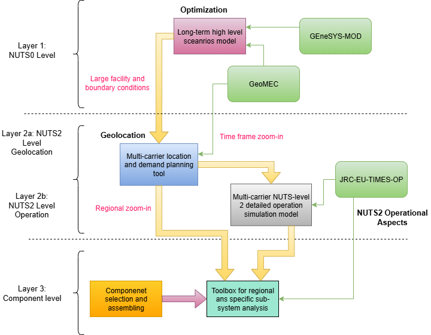

# JRC_EU_TIMES_OP

This README provides an overview of the Model JRC-EU-TIMES-OP for the iDesignRES project.
It is handled by PSI (Paul Scherrer Institute)

## Purpose of the JRC-EU-TIMES-OP Model

In the iDesignRES project, a multi-layered modelling approach is adopted to address energy system transition-related questions at different spatial, temporal, and system-component levels. The layered approach caters to any specific modelling, data, and research questions related to the needs of the stakeholders corresponding to test case regions.

The system operational model JRC-EU-TIMES-OP is hosted at layer 2 and it interacts primarily with the [GeoMEC](https://github.com/iDesignRES/GeoMEC) model and possibly with various multi-physics component models. The primary role of JRC-EU-TIMES-OP is to validate GeoMEC's system portfolio designed for a targeted year, with respect to operational feasibility at the NUTS2 level at a high temporal resolution. This is achieved by stress-testing the system configuration of GeoMEC under various extreme operational conditions. To validate the system configuration for operational feasibility, various performance indicators are calculated and checked for acceptability. In case these indicators exceed acceptable thresholds, an iterative feedback loop will ensure that GeoMEC can consider operational information during optimisation and redesign system configuration.

## Model design philosophy

JRC-EU-TIMES-OP is developed by further extending the JRC-EU-TIMES european energy ssytem planning model. Both the models are based on open-source TIMES modeling framework developed by by the Energy Technology Systems Analysis Program of the International Energy Agency (IEA-ETSAP). TIMES is written in GAMS (general Algebric Modeling System) language. The TIMES code is maintained by the IEA-ETSAP in their [Github repositiory](https://github.com/etsap-TIMES/TIMES_model). Detailed documentations of the TIMES modeling framework and user guides are also available [here](https://github.com/etsap-TIMES/TIMES_Documentation).

### TIMES Modeling Framework

TIMES is a technology-rich bottom-up dynamic energy system model generator. It is developed. TIMES based models minimize the total system cost (investment, operation and maintenance, energy import, export, and delivery, resource extraction, tax, subsidies, etc.), or equivalently maximize the total surplus while satisfying several constraints over the modeling horizon. It calculates the values of different decision variables such as technology activity, capacity, investment cost, and the price of commodities for the multi-period planning horizon. Along with satisfying primary constraints like energy balance, it satisfies user-specified specific conditions such as a limit on RE penetration and emission intensity.

### JRC-EU-TIMES Planning Model

JRC-EU-TIMES-OP is developed by further extending the JRC-EU-TIMES planning model. The version of the JRC-EU-TIMES model that has been used to develop the JRC-EU-TIMES-OP model is available [here](https://gitea.psi.ch/POLIZERO/JRC-EU-TIMES). JRC-EU-TIMES is an open-source, multi-region, multi-sectoral, and multi-carrier, dynamic energy system model of 30 European countries which operates at a national level with twelve annual time slices. It's goal is to minimise the system cost over the planning horizon by simultaneously making investment (or retirement) and operating decisions to meet energy service demands. In the process of doing that, it considers several constraints related to resource potential, technology deployment, energy policy and targets, etc. The model has a detailed representation of the energy supply, conversion, transmission, distribution, storage, and end-use. As a whole-energy-system model, it captures interdependence among the different energy sectors and regions. It also optimizes endogenous trading of energy commodities, e.g., electricity, gas, hydrogen, carbon permits and green certificates, and investment in corresponding infrastructure, e.g., electricity transmission lines or gas and hydrogen pipelines. 

### JRC-EU-TIMES-OP Operational Model

The role of the JRC-EU-TIMES-OP model in iDesignRES is to check and validate whether the system portfolio designed by GeoMEC is operationally adequate, flexible, and reliable under a high-resolution representation of supply and demand. The JRC-EU-TIMES-OP model optimises short-term sector-coupled energy system operation and computes high-temporal-resolution activity profiles (i.e., dispatch) for technologies related to the supply and demand of electricity, heat, hydrogen, gas, and other vectors. 

 The objective function minimises operating costs, including fuel costs, variable O&M costs, import expenditures or export revenues, and penalty terms for unserved demand or flexibility shortages. Short-lead-time investments, e.g., batteries or demand-side-management measures, can be endogenously deployed to mitigate GEOMEC-derived infeasibilities. The investment expenditures for these assets are also accounted for in the model's objective function. Specifically, the JRC-EU-TIMES-OP model:

 - Represents system operation at high temporal resolution (from 12 to 2016 time slices per year) 
- Reflects NUTS2 spatial granularity for the test-case regions
- Incorporates technology-specific operational constraints 
- Captures multi-vector interactions across electricity, gas, hydrogen, heat and fuel networks
- Includes additional operational parameters and constraints for infrastructures (e.g., electricity grids, gas pipelines). 

The JRC-EU-TIMES-OP model is designed in a such way that a specific model instance can be generated dynamically based on the GeoMEC model outputs and other data inputs. A specific model instance which was developed with JRC-EU-TIMES's model outputs is available [here](https://gitea.psi.ch/iDesignRES/JRC_EU_TIMES_OP_idesignres_TS2016).

## Input to and output of JRC-EU-TIMES-OP

### Inputs

from GeoMEC Model: 
- Installed technology capacities of supply, conversion and storage technologies
- Annual activity levels of technologies and electricity, hydrogen, heat, fuel balances
- Final energy demands by sector and regions
- Regional definitions and NUTS2 geographical boundaries
- Common parameters between models (e.g., efficiencies, cost, prices)

Additionally:
- Operational parameters of technologies (e.g., ramp rates, start-up time, line reactance)
- Temporal energy demand profiles 
- Resource availability profiles (wind, solar, hydro, etc.) aligned between the two models
- Network data (electricity transfer capacities, gas/ hydrogen pipeline limits) where available
- Stress-test parameters

### Outputs

- High-temporal-resolution activity profiles (i.e., dispatch) for technologies 
- Demand not served (electricity, gas, hydrogen, heat)
- Renewable curtailment and its temporal/spatial patterns
- Storage behaviour, state-of-charge trajectories and cycling frequency
- Use of flexibility resources (hydro-reservoirs, batteries, demand-side management, power-to-X)
- Infrastructure bottlenecks, including network or inter-vector constraints

## Core Modeling Features

JRC-EU-TIMES-OP retains the mathematical foundation of the TIMES framework while activating additional constraints to represent detailed operational behaviour. 

Key equation groups of TIMES include:

- Energy balance equations for all commodities at each time slice and region
- Technology activity constraints, linking inputs and outputs via efficiency coefficients or emissions factors 
- Storage balance equations, representing state-of-charge, charging/discharging efficiencies and reservoir inflows
- Renewable resource availability via time-slice specific availability factors
- Curtailment equations and variables allowing renewable reduction when network or flexibility resources are insufficient 
- Import/export constraints reflecting electricity and gas/hydrogen interconnection limits 
- Adequacy and reserve constraints, which can be activated for stress tests

Additional modelling features to support system operational assessment:

- Unit Commitment and Dispatch
- Electricity and Gas Grid modelling
- Ancillary Service Markets
- Residual load curves

## Repository Links

- [TIMES Modeling framework]((https://github.com/etsap-TIMES/TIMES_model))
- [JRC-EU-TIMES Model](https://gitea.psi.ch/POLIZERO/JRC-EU-TIMES)
- [JRC-EU-TIMES-OP Model Prototype]((https://gitea.psi.ch/iDesignRES/JRC_EU_TIMES_OP_idesignres_TS2016))